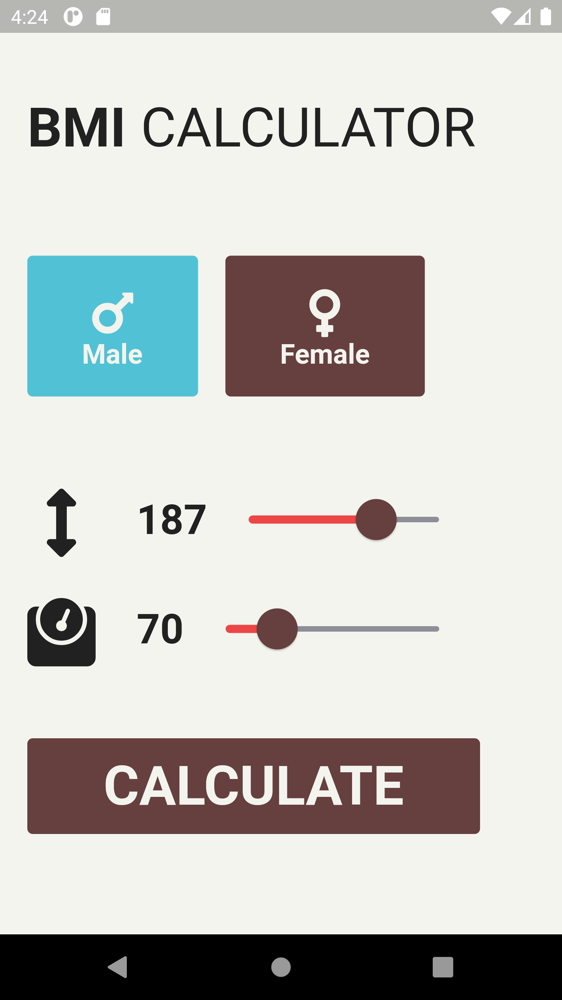
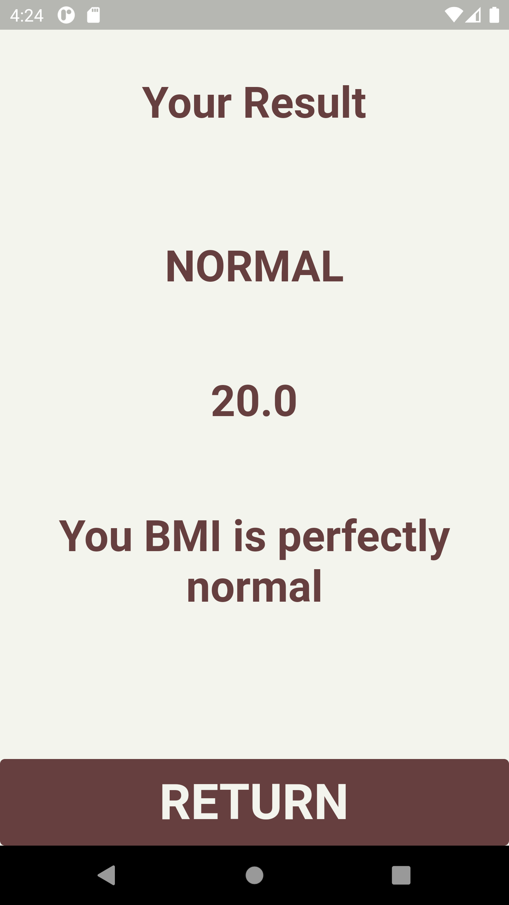
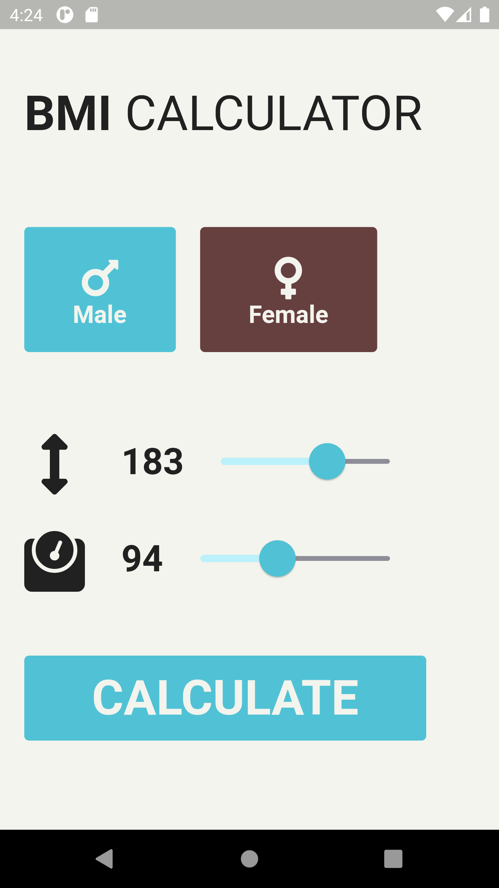
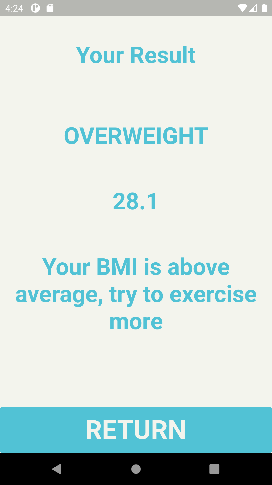

# bmicalc

A BMI calculator made with Flutter, dynamically changes color depending on selected gender

Screenshots below ran on the Nexus 6 virtual device, not yet tested on an iOS device

<h2>Female</h2>

 
<h2>Female results</h2>

 
<h2>Male</h2>

 
<h2>Male results</h2>

